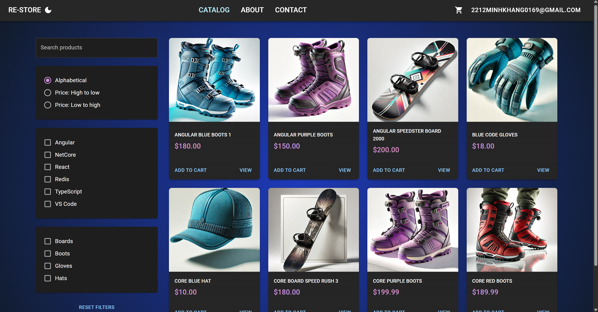
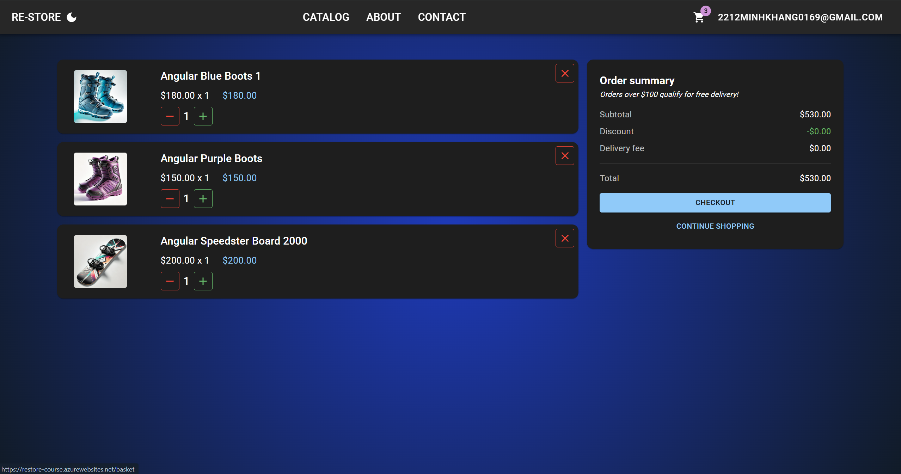
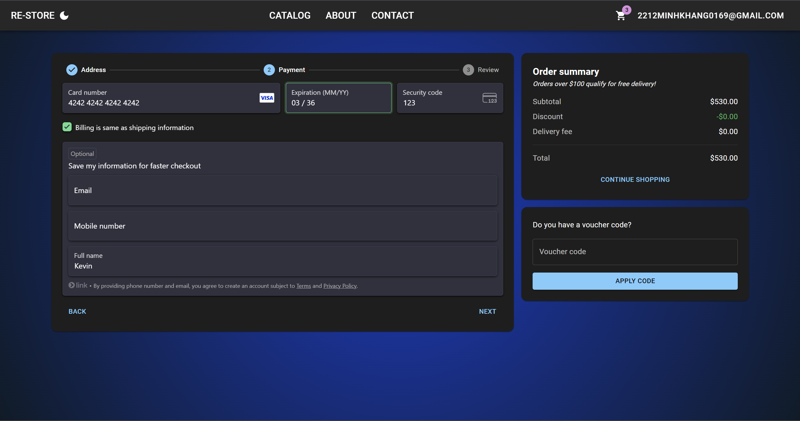
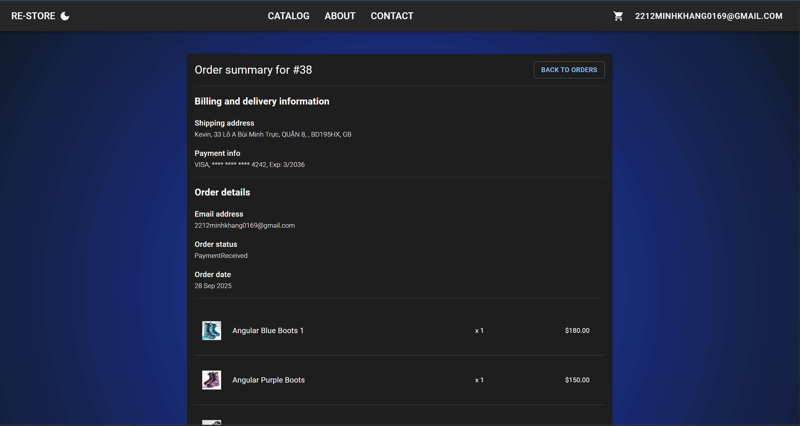
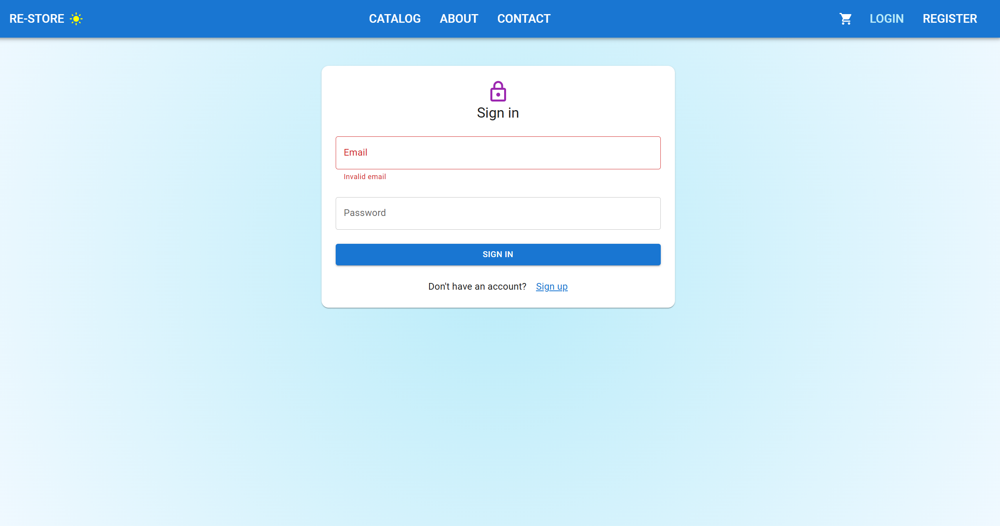

# 🛒 E-Commerce Store (Fullstack .NET + React)

## 📖 Overview
This is a fullstack **E-Commerce Store application** built with **.NET 7** on the backend and **React 18** on the frontend.  
The project demonstrates a complete workflow of creating a modern web application — from database, API, authentication, frontend UI, to deployment.  

## 📹 YouTube Demo (Click the Photo)
---

---
## ⚡ Getting Started
### Prerequisites
- Node.js  
- .NET 7 SDK  
- SQL Server  

### Installation
1. Clone the repository  
2. Navigate to the backend folder and run:
   dotnet restore
   dotnet ef database update
   dotnet run
Navigate to the frontend folder and run:
  npm install
  npm start
---

## 📸 Features
### Product Page
- **Product Management**  
  - Paging, searching, sorting, and filtering
    

### Basket
- **Shopping Basket & Orders**  
  - Add/remove items to basket  
  - Checkout flow to create an order
    

### Checkout
- **Payment Integration**  
  - Stripe payments with EU **3D Secure** standards
    

### Billing

### Order History

### Sign-in
- **Authentication & Authorization**  
  - User registration and login with **ASP.NET Identity**
    

---
## 🛠 Tech Stack
- **Backend**: .NET 7, ASP.NET Core Web API, Entity Framework Core, ASP.NET Identity  
- **Frontend**: React 18, Redux, React Router 6, Material UI, React Hook Form, Axios  
- **Database**: SQL Server (via EF Core)  
- **Payments**: Stripe  
- **Deployment**: Heroku  
- **Tools**: Visual Studio Code  

---

